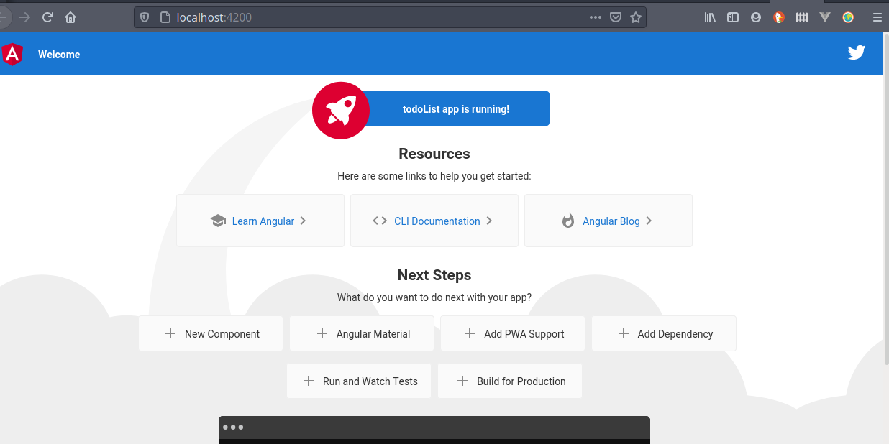

# Instalación

La instalación de Angular es muy sencilla, requiere tener previamente instlado `npm`.

Se recomienda ampliamente apoyarse en la documentación de [Angular](https://angular.io/guide/setup-local)

El primer paso es instalación el framework de Angular de manera global, para lo cual en el caso de sistemas basados en Unix (GNU/Linux o MacOS) debemos tener la contraseña a la mano pues emplearemos el comando `sudo`

```sh
npm install -g @angular/cli
```

Probablemente nos pregunte si queremos enviar información estadistica a los desarrolladores de Angular, la opción por defecto es No (N), por lo que simplemente podemos dar "enter" o poner "N" y dar enter.

Una vez instalado debemos asegurarnos que no haya ningún problema para lo cual podemos crear una sencilla aplicación:

```sh
ng new my-app
```

Esencialmente nos preguntará 2 cosas:

La primera, si queremos agregar el router a nuestro proyecto, se recomienda indiciar que sí. Después nos preguntará como queremos agregar los estilos, algunas opciones son: `css`, `scss`, `sass`, `less`, etc. Se recomienda elegir *css*.

Una vez que el proceso ha finalizado debemos cambiarnos a la carpeta que se creo con el nombre del proyecto e iniciar el servidor, para ello

```sh
cd my-app
ng serve --open
```

Al terminar de compilar los archivos de TS a JS se nos abrirá el navegador en la dirección `localhost/4200` y se deberá mostrar una pantalla similar a la siguiente:



En caso de que no se abrá el navegador se puede abri manualmente e ingresar la siguiente dirección en la barra de navegación

```sh
http://localhost:4200/
```

