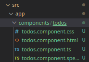
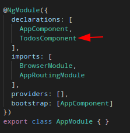
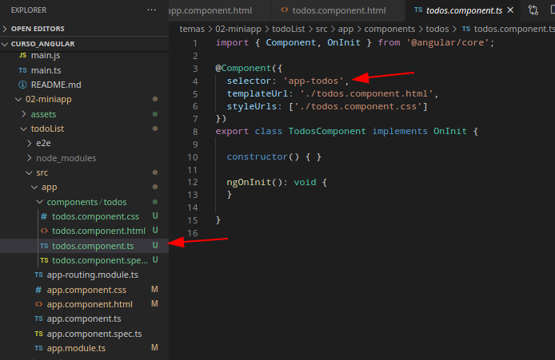

## Introducción a Angular

Con esta miniapp se tiene como objetivo familiarizarse con los "comandos" y componentes de Angular

**Nota: Se esta usando la viersión 10 de Angular**

En caso de no tener un proyecto de Angular, revisar la sección de [instalacion](../01-instalacion/README.md)

Todos los frameworks de JS para frontend (Angular, ReactJS, VueJS, ...) permiten modularizar y jerarquizar nuestro código por defecto. Además proveen de mecanismos para controlar el estado de los componentes de nuestra aplicación, entre otras cosas.

En particular, Angular trabaja muy arraiga con el patrón de diseño  *MVC (Modelo Vista Controlador)*, el cual en resumidas cuentas separa la lógica de la aplicación de la vista y además separa de estos dos la lógica para realizar peticiones a servicios o web o consultas al modelo de datos.

Trabajar asiduamente con el modelo MVC puede tener la ventaja de tener modularizado nuestro código pero también puede tener la desventaja de generar una jerarquía innecesariamente compleja, *¿cuál es la solución?* Debemos estar muy seguros si conviene utilizar Angular para nuestra aplicación o necesitamos algo menos potente.

### Estructura de un proyecto en Angular

### Directorios importantes

* `e2e`. Es una carpeta en donde se almacenan configuraciones para hacer pruebas *end to end* (e2e)
* `node_modules` En esta carpeta se encuentra el código de todas las dependencias de nuestro proyecto definidas en el archivo `package.json`
* ` src`. Aquí se encuentra el código fuente de nuestra aplicación
  * Dentro de `src` tenemos el directorio `assets` en el cual podremos todos los recursos gráficos para la parte estática de la página, imágenes, pequeños videos, animaciones, etc.
  * `environments`. Se definen ambientes de trabajo los distintos estados de nuestra aplicación (producción o desarrollo, generalmente)
  * `app`. Contiene los archivos que hemos creamos para los componentes de nuestra aplicación.

#### Archivos importantes de un proyecto en Angular

* `package.json`. En este archivo se incluyen las configuración del proyecto, por ejemplo, el nombre, la versión y principalmente las dependencias que este necesita. Este archivo se crea al momento de crear al proyecto y se va actualizando cada que instalamos nuevas bibilotecas a nuestro proyecto.
* `.gitignore`. En este archivo se definen los nombre de archivos o directorios que queremos que el controlador de versión GIT ignore.
* `angular.json`. Se definen configuraciones propias de angular, por ejemplo, la estructura de la app y sus configuraciones.
* `.browserlistrc`. Define una lista de navegadores que el autoprefix ajustará para darles soporte CSS.
* ` tsconfig.json`. Define la configuración de la compilación de archivos TypeScript
* `tsconfig.app.json`. Se utiliza para escribir las configuraciones especifícas de la aplicación. Este archivo sobreescribe las configuraciones de `tsconfig.json`
* `tsconfig.spec.json`. Define las configuraciones para realizar *pruebas unitarias*, sobreescribe las configuraciones de `tsconfig.json`
* `tslint.json`. Es el archivo de configuración de reglas que puede usar cualquier *linter* para comprobar que el archivo no tiene errores, bugs, errores de estilo, construcciones sospechosas, etc.
* `karma.conf.js`.  Archivo de configuración para realizar pruebas de ejecución.

*Archivos que se encuentrar en `src`*

* `favicon.icon`. Este archivo especifica un pequeño icono que aparece junto a la pestaña del navegador de un sitio web.
* `index.html`. Este es el archivo de entrada que contiene el contenedor de alto nivel para la aplicación angular.
* `polyfills.ts`. Este archivo es un conjunto de código que se puede utilizar para proporcionar compatibilidad con navegadores antiguos. El código de Angular 7 está escrito principalmente en las especificaciones del lenguaje ES6.
* `test.ts`. Este es el archivo principal que la herramienta `ng` de angular CLI utiliza para transversar todas las pruebas unitarias de la aplicación y ejecutarlas.
* `style.css`. Es el archivo de estilos a nivel global de la aplicación.
* `mains.ts`. Este es el primer archivo `.ts` que se ejecutará. Este archivo arranca (inicia) el AppModule desde app.module.ts y se puede usar para definir configuraciones globales.

Angular trabaja con componentes y módulos, los cuales se explicarán *a posteriori*, por defecto tenemos un componente llamado *app*, por lo cual se explicará la estructura de su archivos.

* `app.component.css`. Define los estilos del componente
* `app.component.html`. Contiene las estructuras `html` necesarias para nuestro componente. Este archivo es requerido por angular la inyectarle los datos provenientes de nuestro modelo de datos o *web service*.
* `app.component.spec.ts`. Este archivo es un archivo de prueba unitario relacionado con el componente de la aplicación.
* `app.component.ts`.  Este es el archivo `ts` más importante que incluye la lógica de vista detrás del componente.

### Comandos CLI de Angular 

* CLI significa Commands Line Interface

Angular define muchos comandos de línea comandos muy utiles, entre sus principales funciones están:

* Agregar librerías
* Generar componentes
* Arrancar el servidor de pruebas de *ng*, etc.

Para tirar comandos de angular necesitamos una terminal abierta en el directorio correspondiente al proyecto en donde estamos trabajando. Algunos comandos utiles para un usuario sin previo conocimiento del manejo de un terminal son:

* ls
* pwd
* cd / dir

La sintaxis para ejecutar comandos de angular, de manera general es:

```sh
ng <comando> [opciones]
```

Aunque puede haber variaciones.

### Empecemos

**Componentes reutilizables**

Al estar creando aplicaciones en Angular debemos tomar en cuenta que todas nuestras aplicaciones deben estar perfectamente moduladas para que los componentes que creemos puedan ser perfectamente reutilizables.

En Angular se reconocen 3 formas principales de crear código reutilizable:

* A través de módulos
* A través de servicios
* A través de componentes

#### Arquitectura básica de Angular

Para entender perfectamente las relaciones entre módulos, servicios, compontentes y plantillas nos apoyaremos en el siguiente esquema:


El **sistema de módulos** de Angular se llama `NgModules`, el cual se puede entender como un contender de código dedicado a un dominio específico de la aplicación, un flujo de trabajo o un conjunto de capacidades estrechamente relacionado. 

* Por ejemplo, podríamos tener un módulo que solo se encargue de la autentificación de los usuarios y esta sea su única tarea.
* Otro módulo podría estar enfocado únicamente a un *carrito de compras* cuyas tareas sean agregar y quitar del carrito de compras, calcular el total, posibles descuentos, etc.

Todas las aplicaciones de Angular tienen por lo menos un módulo, el que se incluye por defecto, convencionalmente llamado `AppModule`, de hecho para lanzar nuestra aplicación usualmente arrancamos (bootstraping), dicho módulo, también conocido como *root NgModule*.

Un módulo puede estar integrado por varios *componentes*, de hecho por ello se puede decir que los módulos proveen de *contexto de compilación* a sus componentes, le indican o asocian imports, exports, directivas, etc. 

La siguiente imagen ilustra los componentes de un módulo de Angular (NgModule)


Organizar el código en distintos módulos funcionales ayuda a administrar el desarrollo de aplicaciones complejas y a diseñar pensando en la reutilización.

Por otra parte, los **Componentes** de Angular definen una clase que contiene la lógica y los datos de la aplicación asociados con una *plantilla HTML*. Dicha plantilla define la vista que será desplegada. En resumen, un componente controla una pieza de la pantalla llamada vista.

Por último, los componentes utilizan **servicios**, los cuales proveen funcionalidades específicas que no están directamente relacionadas a las vistas, el ejemplo más común es obtener datos de nuestra fuente datos (*webservice*, Firebase, etc.)

Angular distingue los componentes de los servicios para aumentar la modularidad y la reutilización. Al separar la funcionalidad relacionada con la vista de un componente de otros tipos de procesamiento, puede hacer que sus clases de componentes sean simples y eficientes.

Por lo anterior, un componente puede delegar ciertas tareas a los servicios, como obtener datos del servidor, validar la entrada del usuario o iniciar sesión directamente en la consola.

Los servicios utilizan mucho el concepto de Dependency Injection por lo que se recomienda revisarlo [aquí](https://angular.io/guide/dependency-injection)

**Tanto los módulos como los componentes y servicios** utilizan *decoradores*, los cuales son una herramienta proporcionada por *TypeScript* que básicamente proveen metadatos que le dicen a Angular cómo utilizarlos.

Los **decoradores** son funciones que modifican las clases de JavaScript. Angular define una serie de decoradores que adjuntan tipos específicos de metadatos a las clases, para que el sistema sepa qué significan esas clases y cómo deberían funcionar.

Ahora sí ... ¡Vayamos al código!

#### Entry point

Al abrir el archivo `index.html` observamos que tenemos una nueva etiqueta, llamada selector:

```html
<body>
  <app-root></app-root> <!-- Nueva etiqueta --> 
</body>
```

Dicha etiqueta define un punto de entrada desde el cual `AppModule` iniciará con la carga de los componentes necesarios para incorporar todo lo necesario para que Angular trabaje.

**¿Dónde empezamos a modificar?**

Recordemos que tenemos carpeta `app` que cómo se mencionó, tiene tres archivos esenciales de los cuales generalmente ocuparemos dos:

* `app.component.ts`
* `app.component.html`

Observar que en `app.component.ts` tenemos lo siguiente

```ts
import { Component } from '@angular/core'; // Solo importamos lo que necesitamos

// Estos es un decorador
@Component({
  selector: 'app-root',
  // Este archivo esta asociado con el template que señala templateUrl
  templateUrl: './app.component.html',
  // Definde los estilos para el template antes mencionado  
  styleUrls: ['./app.component.css']
})

// En esta clase podremos la lógica de negocio y los datos de nuestro componente
export class AppComponent {
  title = 'todoList';
  // Agreguemos cosas
  autor:string = 'Rodrigo'
  edad:number = 23  
}
```

Ahora vayamos a `app.component.html` y borremos todo el contenido excepto por la última línea (`<router-outlet></router-outlet>`), la cuál únicamente comentaremos.

Escribamos un poco de HTML

```html
<h1>Hola mundo {{autor}}</h1> 
<p>
    {{2 + 2}}
</p>

<!-- <router-outlet></router-outlet> -->
```

Al llamar a un atributo de la clase con la que está enlazado nuestro template tenemos que utilizar interpolación: `{{autor}}` 

**Pipes**

```html
<h1>Hola mundo {{autor | upercase }}</h1> 
```

#### Data binding

¿Cómo es posible que podamos utilizar inteporlación en un archivo `html`, pues es gracias al *data binding*.

Si no utilizariamos angular, tendríamos que inyectar elementos al DOM de manera manual y declarar eventos que permitan responder a las acciones del usuario, sin embargo a medida que tengamos más información, ésta será más díficil de distinguir en nuestro código, por ejemplo:

```js
// Fragmento tomado del ejemplo de la clase pokemon 
const input = document.createElement('input');
const header = document.createElement('h1');
const subHeader = document.createElement('h2');
const button = document.createElement('button');

header.innerHTML = "Quien es este pokemon?";
button.innerText = 'Intentar de nuevo';

document.body.append(header);
document.body.append(input);

input.addEventListener('keyup', function(event) {
	
	if (event.key === "Enter") {
	//	console.log(event);
		if (pokemonName.toLowerCase() == input.value.toLowerCase()) {
			subHeader.innerHTML = "Felicidades, eres un maestro pokemon";
		} else {
			subHeader.innerHTML = `Perdiste, el nombre correcto es ${pokemonName}`;
		}
	
	document.body.append(subHeader);
	document.body.append(button);
	input.value = '';
	}
});

button.addEventListener('click', function(event) {
	window.location.reload();
});
```

En lugar de hacer lo anterior, Angular separa perfectamente la lógica de la vista y para ello se apoya en componentes que están enlazados con plantillas (en donde se definen las vistas), como se puede apreciar en la siguiente imagen:


#### Creación de componentes

Para crear un nuevo componente tenemos que hacer uso del CLI

```sh
ng generate component components/todos
```

En este caso la sintaxis es `ng generate component` seguida del nombre del componente que queramos crear. Adicional a ello podemos indicar el directorio en donde queremos que se guarde dicho componente, con la finalidad de tener un mayor orden. Por ello antes del nombre tener `components/`

Al terminar el comando se crean los archivos que se ven a continuación:



Además, la lista de componentes registrados en nuestro NgModule aumenta:



Cada componente que creemos se debe registrar en el módulo para podamos ocuparlo, afortunadamente el CLI hace esto por nosotros.

Tener en mente que estamos intentando crear una estructura similar a la de la izquierda:


Solo que tendrá más niveles de anidamiento.

Ahora, usemos nuestro componente recién creado, abrimo el archivo `html` y escribimos lo siguiente

```html
<h3>Estos son todos mis pendientes</h3>
```

Para usar el componente debemos usar el nombre definido  la variable `selector`, que se el decorador `@Component`, del archivo `.ts`



Dicho nombre lo utilizamos en el `app.component.html`

```html
<app-todos></app-todos>
```

Observar que el archivo `todos.component.ts` presenta una diferencia con respecto del de `app.component.ts`, se agrega un método llamado `OnInit`

```ts
import { Component, OnInit } from '@angular/core';

@Component({
  selector: 'app-todos',
  templateUrl: './todos.component.html',
  styleUrls: ['./todos.component.css']
})
export class TodosComponent implements OnInit {

  constructor() { } // Se utiliza para incluir servicios

  ngOnInit(): void { // Se utiliza para inicializar edos. de vars.
  }
    
}
```

Para tener todo bien modulado debemos crear una *clase de datos*, un término super empleado en Java o general siempre que se quiere consumir datos de un servicio que tengan cierta estructura. 

Creamos un directorio en `app` llamado `models` y en él creamos un archivo llamado `Todo.ts`, cuyo contenido es el siguiente:

```ts
export class Todo {
    id:number;
    titulo:string;
    completado: number | boolean;

    constructor(
        id?:number,
        titulo?:string,
        completado?:number|boolean
    ) {
        if (id && titulo && completado) {
            this.id = id;
            this.titulo = titulo;
            this.completado = completado
        }
    }
}
```

**Nota:** Esta clase de datos también se puede crear con Angular CLI: `ng generate class models/Todo`

Ahora utilizamos esta clase en la clase `ts` de *todos*, para ello debemos importarla de la siguiente forma:

```ts
import Todo from '../../models/Todo';
```

Ahora la usamos para crear un arreglo de *Todos*

```ts
// ... Se omiten ciertas cosas que estan arriba de la clase
export class TodosComponent implements OnInit {

  todos: Todo[];

  constructor() { }

  ngOnInit(): void {
    this.todos = [
      {
        id:1,
        titulo:'Hacer los ejercicios de JS',
        completado: true
      },
      {
        id:2,
        titulo:'Instalar npm',
        completado: false
      },
      {
        id:2,
        titulo:'Inscribirse a Laravel',
        completado: 0
      },
    ]
  }

}
```

Ahora intentemos imprimir estas tareas en nuestro sitio web para ellos debemos ir  `todos.component.html` e imprimirlos de la siguiente manera

* Debemos usar un *loop*

#### Directivas

Las directivas son en realidad *decorators* pero para nuestros fines las podemos ver como elementos que podemos utilizar en nuestro `.html` para crear una página más dinámica.

En Angular tenemos dos tipos de directivas:

* Directivas Estructurales
  * NgIf
  * NgFor
  * NgSwitch.
* Directivas de atributo
  * NgStyle
  * NgClass

Regresando al código:

`todos.component.html`

```html
<ul *ngFor="let todo of todos">
    <li>{{todo.titulo}}</li>
</ul>

```

> ¿Por qué es necesario el asterisco (*)  en las directivas estructurales? En realidad es *sugar sintaxis*, para más información  ir a la sección [The asterisk (*)](https://angular.io/guide/structural-directives#the-asterisk--prefix) prefix de la documentación de Angular

<!-- A partir de aquí faltan muchas explicaciones, ahora solo comando y código -->

```sh
ng g c components/TodoItem
```

`todos.component.html`

```html
<!-- Se utiliza un directiva de atributo que hemos definido -->
<app-todo-item *ngFor="let todo of todos" [todoProp]="todo">
</app-todo-item>
```

**Uso de input para pasar información entre componentes**

`todo-item.components.ts`

```ts
import { Component, OnInit,Input } from '@angular/core';
```

```ts
import { Component, OnInit,Input } from '@angular/core';
import Todo from 'src/app/models/Todo'; // Se autoimporta

@Component({
  selector: 'app-todo-item',
  templateUrl: './todo-item.component.html',
  styleUrls: ['./todo-item.component.css']
})
export class TodoItemComponent implements OnInit {

  @Input() todoProp: Todo; // Uso de input

  constructor() { }

  ngOnInit(): void {
  }

}

```

Por último modificamos el `todo-item.component.html`

```html
<p>{{ todoProp.titulo }}</p>
```

Ahora, no solo queremos imprimir el titulo, por lo que agregaremos más elementos:

```html
<div>
 <p>
    <input type="checkbox"> 
    <label for="{{ todoProp.id }}">
        {{ todoProp.titulo }}
      </label>
    <button class="del">x</button>
</p>   
</div>	
```

Agreguemos los estilos:

`syle.css`

 ```css
* {
  box-sizing: border-box;
  margin: 0;
  padding: 0;
}

body {
  font-family: Arial, Helvetica, sans-serif;
  line-height: 1.4;
}

a {
  color: #333;
  text-decoration: none;
}

.container {
  padding: 0 1rem;
}

.btn {
  display: inline-block;
  border: none;
  background: #555;
  color: #fff;
  padding: 7px 20px;
  cursor: pointer;
}

.btn:hover {
  background: #666;
}
 ```

`todo-item.component.css`

```css
.del {
  background: #ff0000;
  color: #fff;
  border: none;
  padding: 5px 9px;
  border-radius: 50%;
  cursor: pointer;
  float: right;
}

.todo {
  background: #f4f4f4;
  padding: 10px;
  border-bottom: 1px #ccc dotted;
}

.is-complete {
  text-decoration: line-through;
}
```

**Directiva NgClass**

Ahora queremos que se apliquen los estilos `todo` y `is-complete` del css para ello las vamos a enlazar al componente de manera dinámica con las siguientes reglas:

* Siempre vamos a requerir el estilo `todo`, 
* `is-complete` solo se utiliza si el todo tiene el atributo `completado` en `true`
  * Les toca hacer más extensible este para que también sirva cuando completado es un número y su valor es uno

Para ello el archivo `todo-item.component.html` debe quedar de la siguiente manera:

```html
<div [ngClass]="clasesCSS()">
    <!-- permanece igual -->
</div>
```

Ahora en el controlador de este template (el archivo ` ts`)

```ts
export class TodoItemComponent implements OnInit {

  @Input() todoProp: Todo;

  constructor() { }

  ngOnInit(): void {
  }
  <!-- New -->
  clasesCSS(){
    let clases = {
      todo: true,
      'is-complete': this.todoProp.completado === true
    }
    return clases;
  }
  <!-- Finishd New -->

}
```

**Eventos**

Los eventos comunican cambios en la interfaz de usuario a la clase controladora, veremos dos

* click
* change

Para ello seguiremos modificando nuestro `todo-item.component.html`

``` ts
<div [ngClass]="clasesCSS()">
    <p>
        <input type="checkbox" (change)="toggle(todoProp)"> 
        <label for="{{ todoProp.id }}">
            {{ todoProp.titulo }}
          </label>
        <button (click)="borrarItem(todoProp)" class="del">x</button>
    </p>    
</div>
```

Y ahora debemos declarar los métodos `toggle` y `borrarItem` en el archivo `ts`

```ts
  toggle(todo:Todo){
    this.todoProp.completado = !todo.completado
    // Actualizar en el servidor
  }
  borrarItem(todo:Todo){
    console.log('Se quiere borrar el item');
  }
```

Se puede mejor la experiencie de usuario vinculando el estado de la nota con el estado del checkbox

```html
<div [ngClass]="clasesCSS()">
    <p>
        <input type="checkbox" 
            (change)="toggle(todoProp)" 
            [checked]="todoProp.completado" 
            id="{{ todoProp.id }}" > 
        <label for="{{ todoProp.id }}">
            {{ todoProp.titulo }}
          </label>
        <button (click)="borrarItem(todoProp)" class="del">x</button>
    </p>    
</div>
```

**¿Cómo implementarias la función delete?**

Para ello debemos recordar que hemos construido nuestro proyecto en componentes jerarquizados. Para poder borrar un elemento tenemos que informarle al componente padre que éste lo debe hacer. Ya que si recordamos, en primer lugar, de él obtuvimos el elemento  *todo*.

Por lo tanto necesitamos importar dos bibliotecas de angular que nos ayudarán:

* Output
* EventEmitter

```ts
import { Component, OnInit,Input,Output,EventEmitter } from '@angular/core'; // NEW
import Todo from 'src/app/models/Todo';

@Component({
  selector: 'app-todo-item',
  templateUrl: './todo-item.component.html',
  styleUrls: ['./todo-item.component.css']
})
export class TodoItemComponent implements OnInit {

  @Input() todoProp: Todo;
  @Output() borrarTodo: EventEmitter<Todo> = new EventEmitter(); // NEW

  constructor() { }

  ngOnInit(): void {
  }

  clasesCSS(){
    let clases = {
      todo: true,
      'is-complete': this.todoProp.completado === true
    }
    return clases;
  }

  toggle(todo:Todo){
    this.todoProp.completado = !todo.completado
    // Actualizar en el servidor
  }
  borrarItem(todo:Todo){
    console.log('Se quiere borrar el item');
    this.borrarTodo.emit(todo) // NEW
  }

}
```

Ahora debemos atrapar este evento en el componente padre, primero veamos `todos.component.html`

```html
<app-todo-item 
    *ngFor="let todo of todos" 
    [todoProp]="todo"
    (borrarTodo)="borrarTodo($event)">
</app-todo-item>
```

Ahora en `todos.component.ts`, agregamos la función "borrarTodo"

```ts
  borrarTodo(todo:Todo){
    console.log('borrame :(');
    this.todos = this.todos.filter(t => t.id!== todo.id)  
  }
```

**Ahora hagamos la funcionalidad para agregar notas y platiquemos del `two way data binding`**

Creamos un nuevo componente

```sh
ng g c componentes/AddTodo
```

`add-todo.component.html`

```html
<form class="form" >
    <input type="text" name="titulo" [(ngModel)]="titulo" placeholder="Agregar nota">
    {{titulo}}
    <input type="submit" value="Submit" class="btn">
  </form>

```

`add-todo.component.ts`

```ts
import { Component, OnInit } from '@angular/core';

@Component({
  selector: 'app-add-todo',
  templateUrl: './add-todo.component.html',
  styleUrls: ['./add-todo.component.css']
})
export class AddTodoComponent implements OnInit {
  titulo:string; // NEW
  constructor() { }

  ngOnInit(): void {
  }

}
```

Pero para trabajar con formularios y con `ngModel` tenemos que importar un módulo para ello en `app.module.ts` agregamos lo siguiente:

```ts
import { FormsModule } from '@angular/forms'
```

Y lo agregamos al `imports` de `@NgModule`.

Agregamos algunos estilos

```css
.form {
    display: flex;
  }
  
  .form input[type='text'] {
    flex: 10;
    padding: 5px;
  }
  
  .form input[type='submit'] {
    flex: 2;
  }
```

Ahora estamos listos para usar el componente `add-todo`, lo agregaremos en `todos.component.html`

```html
<app-add-todo></app-add-todo> <!-- NRW -->
<app-todo-item 
    *ngFor="let todo of todos" 
    [todoProp]="todo"
    (borrarTodo)="borrarTodo($event)">
</app-todo-item>

```

**Two way data binding**

```html
<form class="form" (ngSubmit)="onSubmit()">
    <input type="text" name="titulo" [(ngModel)]="titulo" placeholder="Agregar nota">
    {{titulo}}
    <input type="submit" value="Submit" class="btn">
  </form>
```

Agregamos el handler

```html
<form class="form" (ngSubmit)="onSubmit()">
    <input type="text" name="titulo" [(ngModel)]="titulo" placeholder="Agregar nota">
    <input type="submit" value="Submit" class="btn">
  </form>
```

Y construimos la función `agregarTodo` en el archivo `ts`

```ts
import { Component, OnInit, Output, EventEmitter } from '@angular/core';
import Todo from 'src/app/models/Todo';

@Component({
  selector: 'app-add-todo',
  templateUrl: './add-todo.component.html',
  styleUrls: ['./add-todo.component.css']
})
export class AddTodoComponent implements OnInit {

  @Output() agregarTodo: EventEmitter<any> = new EventEmitter();

  titulo:string;
  constructor() { }

  ngOnInit(): void {
  }

  onSubmit(){
    const todo = {
      titulo:this.titulo,
      completado: false
    }
    this.agregarTodo.emit(todo)
  }
}
```

Mejoramos el `app.component.html`

```html
<app-add-todo (agregarTodo)="agregarTodo($event)"></app-add-todo>
<app-todo-item 
    *ngFor="let todo of todos" 
    [todoProp]="todo"
    (borrarTodo)="borrarTodo($event)">
</app-todo-item>
```

Ahora en `app.component.ts`

```ts
  agregarTodo(todo:Todo){
    // Primero se debería hacer una llamada al servidor
    this.todos.push(todo)
  }
```


<!-- TODO: * Crear Header ( 1h:08min) * Router * IFs -->

<!-- Ciclo de vida de los componentes -->

### Referencias

* [JavaTpoint](https://www.javatpoint.com/angular-7-files-explanation)
* [Angular guide](https://angular.io/guide)

