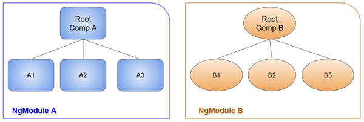

## Introducción a Angular

Con esta miniapp se tiene como objetivo familiarizarse con los "comandos" y componentes de Angular

**Nota: Se esta usando la viersión 10 de Angular**

En caso de no tener un proyecto de Angular, revisar la sección de [instalacion](../01-instalacion/README.md)

Todos los frameworks de JS para frontend (Angular, ReactJS, VueJS, ...) permiten modularizar y jerarquizar nuestro código por defecto. Además proveen de mecanismos para controlar el estado de los componentes de nuestra aplicación, entre otras cosas.

En particular, Angular trabaja muy arraiga con el patrón de diseño  *MVC (Modelo Vista Controlador)*, el cual en resumidas cuentas separa la lógica de la aplicación de la vista y además separa de estos dos la lógica para realizar peticiones a servicios o web o consultas al modelo de datos.

Trabajar asiduamente con el modelo MVC puede tener la ventaja de tener modularizado nuestro código pero también puede tener la desventaja de generar una jerarquía innecesariamente compleja, *¿cuál es la solución?* Debemos estar muy seguros si conviene utilizar Angular para nuestra aplicación o necesitamos algo menos potente.

### Estructura de un proyecto en Angular

### Directorios importantes

* `e2e`. Es una carpeta en donde se almacenan configuraciones para hacer pruebas *end to end* (e2e)
* `node_modules` En esta carpeta se encuentra el código de todas las dependencias de nuestro proyecto definidas en el archivo `package.json`
* ` src`. Aquí se encuentra el código fuente de nuestra aplicación
  * Dentro de `src` tenemos el directorio `assets` en el cual podremos todos los recursos gráficos para la parte estática de la página, imágenes, pequeños videos, animaciones, etc.
  * `environments`. Se definen ambientes de trabajo los distintos estados de nuestra aplicación (producción o desarrollo, generalmente)
  * `app`. Contiene los archivos que hemos creamos para los componentes de nuestra aplicación.

#### Archivos importantes de un proyecto en Angular

* `package.json`. En este archivo se incluyen las configuración del proyecto, por ejemplo, el nombre, la versión y principalmente las dependencias que este necesita. Este archivo se crea al momento de crear al proyecto y se va actualizando cada que instalamos nuevas bibilotecas a nuestro proyecto.
* `.gitignore`. En este archivo se definen los nombre de archivos o directorios que queremos que el controlador de versión GIT ignore.
* `angular.json`. Se definen configuraciones propias de angular, por ejemplo, la estructura de la app y sus configuraciones.
* `.browserlistrc`. Define una lista de navegadores que el autoprefix ajustará para darles soporte CSS.
* ` tsconfig.json`. Define la configuración de la compilación de archivos TypeScript
* `tsconfig.app.json`. Se utiliza para escribir las configuraciones especifícas de la aplicación. Este archivo sobreescribe las configuraciones de `tsconfig.json`
* `tsconfig.spec.json`. Define las configuraciones para realizar *pruebas unitarias*, sobreescribe las configuraciones de `tsconfig.json`
* `tslint.json`. Es el archivo de configuración de reglas que puede usar cualquier *linter* para comprobar que el archivo no tiene errores, bugs, errores de estilo, construcciones sospechosas, etc.
* `karma.conf.js`.  Archivo de configuración para realizar pruebas de ejecución.

*Archivos que se encuentrar en `src`*

* `favicon.icon`. Este archivo especifica un pequeño icono que aparece junto a la pestaña del navegador de un sitio web.
* `index.html`. Este es el archivo de entrada que contiene el contenedor de alto nivel para la aplicación angular.
* `polyfills.ts`. Este archivo es un conjunto de código que se puede utilizar para proporcionar compatibilidad con navegadores antiguos. El código de Angular 7 está escrito principalmente en las especificaciones del lenguaje ES6.
* `test.ts`. Este es el archivo principal que la herramienta `ng` de angular CLI utiliza para transversar todas las pruebas unitarias de la aplicación y ejecutarlas.
* `style.css`. Es el archivo de estilos a nivel global de la aplicación.
* `mains.ts`. Este es el primer archivo `.ts` que se ejecutará. Este archivo arranca (inicia) el AppModule desde app.module.ts y se puede usar para definir configuraciones globales.

Angular trabaja con componentes y módulos, los cuales se explicarán *a posteriori*, por defecto tenemos un componente llamado *app*, por lo cual se explicará la estructura de su archivos.

* `app.component.css`. Define los estilos del componente
* `app.component.html`. Contiene las estructuras `html` necesarias para nuestro componente. Este archivo es requerido por angular la inyectarle los datos provenientes de nuestro modelo de datos o *web service*.
* `app.component.spec.ts`. Este archivo es un archivo de prueba unitario relacionado con el componente de la aplicación.
* `app.component.ts`.  Este es el archivo `ts` más importante que incluye la lógica de vista detrás del componente.

### Comandos CLI de Angular 

* CLI significa Commands Line Interface

Angular define muchos comandos de línea comandos muy utiles, entre sus principales funciones están:

* Agregar librerías
* Generar componentes
* Arrancar el servidor de pruebas de *ng*, etc.

Para tirar comandos de angular necesitamos una terminal abierta en el directorio correspondiente al proyecto en donde estamos trabajando. Algunos comandos utiles para un usuario sin previo conocimiento del manejo de un terminal son:

* ls
* pwd
* cd / dir

La sintaxis para ejecutar comandos de angular, de manera general es:

```sh
ng <comando> [opciones]
```

Aunque puede haber variaciones.

### Empecemos

**Componentes reutilizables**

Al estar creando aplicaciones en Angular debemos tomar en cuenta que todas nuestras aplicaciones deben estar perfectamente moduladas para que los componentes que creemos puedan ser perfectamente reutilizables.

En Angular se reconocen 3 formas principales de crear código reutilizable:

* A través de módulos
* A través de servicios
* A través de componentes

#### Arquitectura básica de Angular

Para entender perfectamente las relaciones entre módulos, servicios, compontentes y plantillas nos apoyaremos en el siguiente esquema:


El **sistema de módulos** de Angular se llama `NgModules`, el cual se puede entender como un contender de código dedicado a un dominio específico de la aplicación, un flujo de trabajo o un conjunto de capacidades estrechamente relacionado. 

* Por ejemplo, podríamos tener un módulo que solo se encargue de la autentificación de los usuarios y esta sea su única tarea.
* Otro módulo podría estar enfocado únicamente a un *carrito de compras* cuyas tareas sean agregar y quitar del carrito de compras, calcular el total, posibles descuentos, etc.

Todas las aplicaciones de Angular tienen por lo menos un módulo, el que se incluye por defecto, convencionalmente llamado `AppModule`, de hecho para lanzar nuestra aplicación usualmente arrancamos (bootstraping), dicho módulo, también conocido como *root NgModule*.

Un módulo puede estar integrado por varios *componentes*, de hecho por ello se puede decir que los módulos proveen de *contexto de compilación* a sus componentes, le indican o asocian imports, exports, directivas, etc. 

La siguiente imagen ilustra los componentes de un módulo de Angular (NgModule)



Organizar el código en distintos módulos funcionales ayuda a administrar el desarrollo de aplicaciones complejas y a diseñar pensando en la reutilización.

Por otra parte, los **Componentes** de Angular definen una clase que contiene la lógica y los datos de la aplicación asociados con una *plantilla HTML*. Dicha plantilla define la vista que será desplegada. En resumen, un componente controla una pieza de la pantalla llamada vista.

Por último, los componentes utilizan **servicios**, los cuales proveen funcionalidades específicas que no están directamente relacionadas a las vistas, el ejemplo más común es obtener datos de nuestra fuente datos (*webservice*, Firebase, etc.)

Angular distingue los componentes de los servicios para aumentar la modularidad y la reutilización. Al separar la funcionalidad relacionada con la vista de un componente de otros tipos de procesamiento, puede hacer que sus clases de componentes sean simples y eficientes.

Por lo anterior, un componente puede delegar ciertas tareas a los servicios, como obtener datos del servidor, validar la entrada del usuario o iniciar sesión directamente en la consola.

Los servicios utilizan mucho el concepto de Dependency Injection por lo que se recomienda revisarlo [aquí](https://angular.io/guide/dependency-injection)

**Tanto los módulos como los componentes y servicios** utilizan *decoradores*, los cuales son una herramienta proporcionada por *TypeScript* que básicamente proveen metadatos que le dicen a Angular cómo utilizarlos.

Los **decoradores** son funciones que modifican las clases de JavaScript. Angular define una serie de decoradores que adjuntan tipos específicos de metadatos a las clases, para que el sistema sepa qué significan esas clases y cómo deberían funcionar.

Ahora sí ... ¡Vayamos al código!

#### Entry point

Al abrir el archivo `index.html` observamos que tenemos una nueva etiqueta:

```html
<body>
  <app-root></app-root> <!-- Nueva etiqueta --> 
</body>
```

Dicha etiqueta define un punto de entrada desde el cual `AppModule` iniciará con la carga de los componentes necesarios para incorporar todo lo necesario para que Angular trabaje.

**¿Dónde empezamos a modificar?**

Recordemos que tenemos carpeta `app` que cómo se mencionó, tiene tres archivos esenciales de los cuales generalmente ocuparemos dos:

* `app.component.ts`
* `app.component.html`

Observar que en `app.component.ts` tenemos lo siguiente

```ts
import { Component } from '@angular/core'; // Solo importamos lo que necesitamos

// Estos es un decorador
@Component({
  selector: 'app-root',
  // Este archivo esta asociado con el template que señala templateUrl
  templateUrl: './app.component.html',
  // Definde los estilos para el template antes mencionado  
  styleUrls: ['./app.component.css']
})

// En esta clase podremos la lógica de negocio y los datos de nuestro componente
export class AppComponent {
  title = 'todoList';
  // Agreguemos cosas
  autor = 'Rodrigo'
  edad = 23  
}
```

Ahora vayamos a `app.component.html` y borremos todo el contenido excepto por la última línea (`<router-outlet></router-outlet>`), la cuál únicamente comentaremos.

Escribamos un poco de HTML

```html
<h1>Hola mundo</h1>

<!-- <router-outlet></router-outlet> -->
```

<!-- Crear componentes -Ciclo de vida de los componentes - Renderizar información entre componentes - Directivas -->

### Referencias

* [JavaTpoint](https://www.javatpoint.com/angular-7-files-explanation)
* [Angular guide](https://angular.io/guide)

